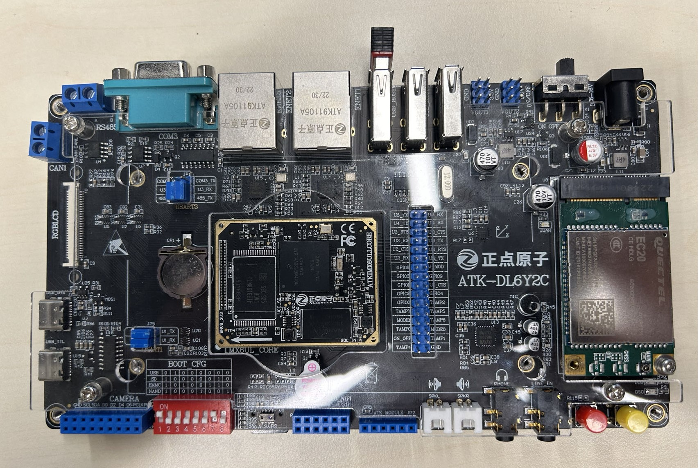
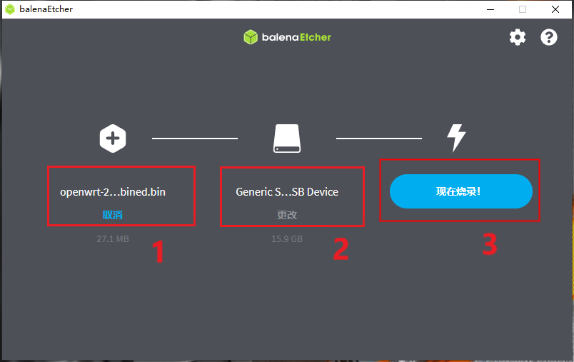
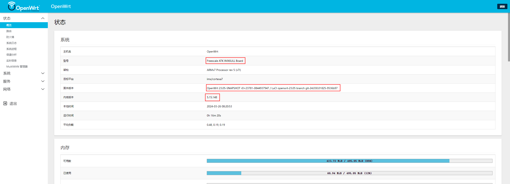
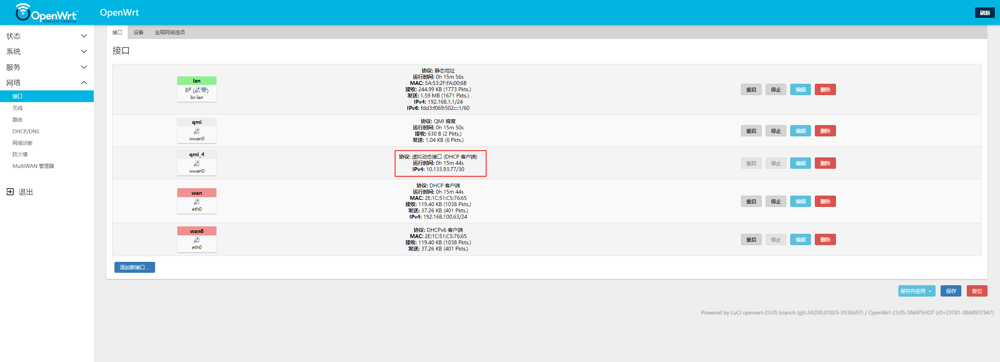
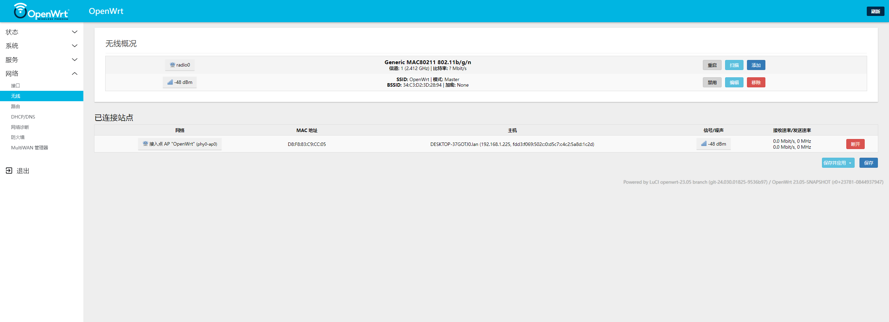

# 快速上手

基于正点原子的 imx6ull 阿尔法开发板，移植 OpenWRT23.05 ，支持 SD 卡和 eMMC 启动。

**功能列表**：

- RTL8188EU 无线
- EC20 4G 联网
- WEB 升级

## 硬件环境

正点原子阿尔法开发板。核心板版本：V1.6，底板版本：V2.2。4G 模块使用 EC20-CEHDLG，无线模块使用 RTL8188EU。



## 软件环境

编译环境：Ubantu20.04。

OpenWRT版本：23.05，uboot版本：2022.01， 内核版本：v5.15.148。

## 编译固件

1. 安装编译依赖

    ```bash
    sudo apt-get install binutils bzip2 diff find flex gawk gcc-6+ getopt grep install libc-dev libz-dev make4.1+ perl python3.7+ rsync subversion unzip which
    ```

2. 下载源码

    ```bash
    git clone git@github.com:boxwoodt/imx6ull_openwrt.git -b imx6ull_openwrt
    ```

3. 更新和安装软件包

    ```bash
    ./scripts/feeds update -a
    ./scripts/feeds install -a
    ```

4. 拷贝配置文件

    ```bash
    cp atk_imx6ull_defconfig .config
    ```

5. 编译固件

    ```bash
    make V=s > make.log 2>&1
    ```

## 固件烧录

通过`balenaEtcher`软件，将固件烧录到 SD 卡中。

烧录软件[下载地址](https://etcher.balena.io/#download-etcher)

IMX6ULL[固件地址](https://github.com/boxwoodt/imx6ull_openwrt/releases/download/v1.0/openwrt-23.05-snapshot-r0+23781-0844937947-imx-cortexa7-imx6ull-atk-emmc-squashfs-combined.bin)



## 运行







