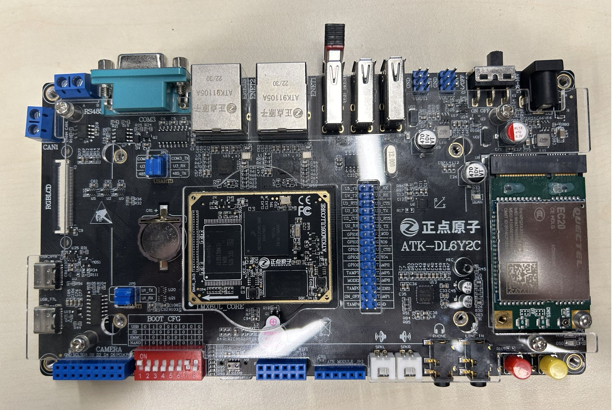
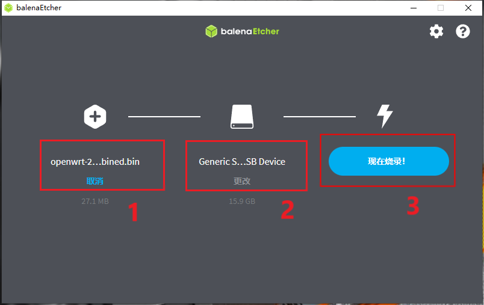
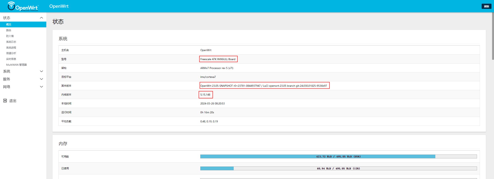
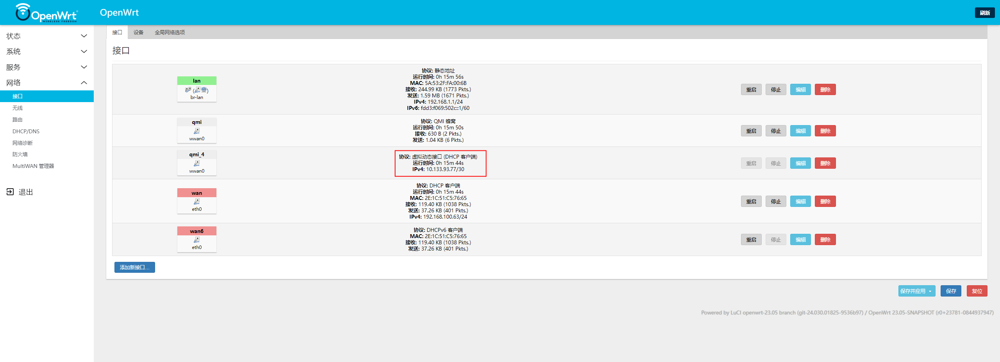
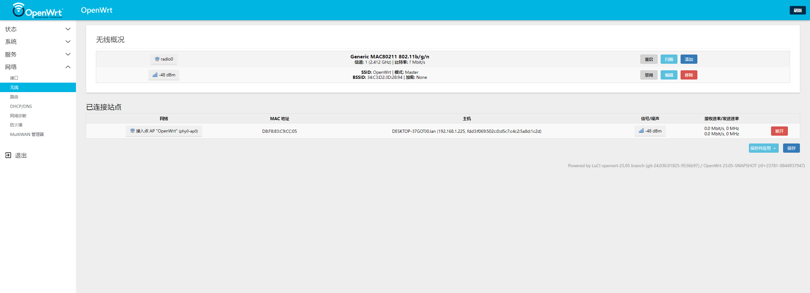

基于imx6ull的OpenWrt开发
++++++++++++++++++++++++++++++++++++

基于正点原子的 imx6ull 阿尔法开发板，移植 OpenWRT23.05 ，支持 SD卡 和 eMMC 启动。

功能列表：

*   RTL8188J 无线
*   EC20 4G 联网
*   WEB 升级

硬件环境
============================================

正点原子阿尔法开发板。核心板 V1.6 ，底板 V2.2 。4G模块使用 EC20-CEHDLG ，无线模块使用 RTL8188EU。

软件环境
============================================

编译环境：Ubantu20.04。

- OpenWRT版本：23.05
- uboot版本：2022.01
- 内核版本：v5.15.148

编译固件
============================================

安装编译依赖
--------------------------------------------------------

.. code-block:: bash

    sudo apt-get install binutils bzip2 diff find flex gawk gcc-6+ getopt grep install libc-dev libz-dev make4.1+ perl python3.7+ rsync subversion unzip which

下载源码
--------------------------------------------------------

.. code-block:: bash

    git clone git@github.com:boxwoodt/imx6ull_openwrt.git -b imx6ull_openwrt

更新和安装软件包
--------------------------------------------------------

.. code-block:: bash

    ./scripts/feeds update -a
    ./scripts/feeds install -a

拷贝配置文件
--------------------------------------------------------

.. code-block:: bash

    cp atk_imx6ull_defconfig .config

编译固件
--------------------------------------------------------

.. code-block:: bash

    make V=s > make.log 2>&1

固件烧录
============================================

通过 `balenaEtcher`_ 软件，将固件烧录到 SD卡 中。

烧录软件下载地址：https://etcher.balena.io/#download-etcher

IMX6ULL固件地址：https://github.com/boxwoodt/imx6ull_openwrt/releases/download/v1.0/openwrt-23.05-snapshot-r0+23781-0844937947-imx-cortexa7-imx6ull-atk-emmc-squashfs-combined.bin

.. _balenaEtcher: https://etcher.balena.io/#download-etcher

运行
============================================

|

|

