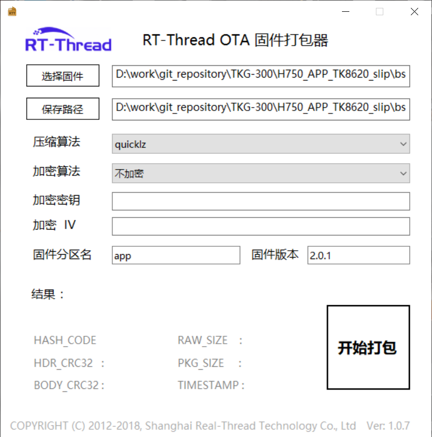

.. _gw320_upgrade-label:

网关升级
================

网关升级包括 **STM32H750固件升级** 和 **TurMass无线模块升级**。

STM32H750升级
++++++++++++++++++++

主控MCU STM32H750，通过两种方式升级固件：串口升级和 AT 指令升级。

升级包制作
------------------------------

1. 打开 ``bsp\stm32\stm32h750\packages\ota_downloader\tools\ota_packager`` 文件夹，双击文件夹中 ``rt_ota_packaging_tool.exe`` 。

2. 点击 ``选择固件`` ，选中编译后的固件，固件分区名输入 **app** ，输入固件版本号，其他配置不更改。点击 ``开始打包`` ，制作完成升级包。升级包路径与选中的固件路径一致。

串口升级固件
------------------------------

网关串口使用 Ymodem 协议传输固件，所以串口工具需要支持 Ymodem 传输。推荐使用 Xshell 升级。

1. 打开 Xshell，选中串口，串口配置为 921600 波特率，数据位 8 位，停止位 1 位，无奇偶校验。按下重启按键，网关重启。快速按下 Enter 键，进入 boot 界面。

2. 输入 ``ymodem_ota`` ，然年后点击回车键，进入传输升级包流程。

3. 在 Xshell 界面上，点击鼠标右键，选择 ``传输`` -- ``YMODEM(Y)`` -- ``用YMODEM发送``。

4. 选中制作好的升级包，网关自动升级。传输完成后，网关自动运行。

AT 指令升级
------------------------------

.. note:: AT 指令升级需要网络正常连接后才能进行。升级文件后缀为 .rbl。

升级指令为 ``AT+MCUOTA``。

- **指令说明**

.. csv-table::
    :header: "指令", "响应"
    :widths: 40 20

    "AT+MCUOTA=<升级地址>", "AT_OK/AT_ERROR"

- **参数说明**

.. csv-table:: 
    :header: "参数", "含义"
    :widths: 40 60

    "<升级地址>",    "升级文件地址"

- **示例**

.. code-block::

    AT+TUROTA="http://download.taolink-tech.com:11180/TKB-320_FW_V1.5.8.rbl"
    AT_OK

TurMass 模块升级
++++++++++++++++++++

TurMass 模块仅支持 AT 指令升级。

.. note:: AT 指令升级需要网络正常连接后才能进行。升级文件后缀为 .bin。

升级指令为 ``AT+TUROTA``。

- **指令说明**

.. csv-table::
    :header: "指令", "响应"
    :widths: 40 20

    "AT+TUROTA=<模块选择>,<清空参数开关>,<升级地址>", "AT_OK/AT_ERROR"

- **参数说明**

.. csv-table:: 
    :header: "参数", "含义"
    :widths: 40 60

    "<模块选择>",    "模块选择范围1 ~ 2
                    - 1 --- 无线模块 1 升级 
                    - 2 --- 无线模块 2 升级
                    "
    "<清空参数开关>", "是否清空无线模块参数
                    | 0 --- 保留参数
                    | 1 --- 清空参数
                    "
    "<升级地址>",    "升级文件地址"

- **示例**

.. code-block::

    AT+TUROTA=0,0,"http://download.taolink-tech.com:11180/TK8620_SLIP_V2.0.7.bin"
    AT_OK
