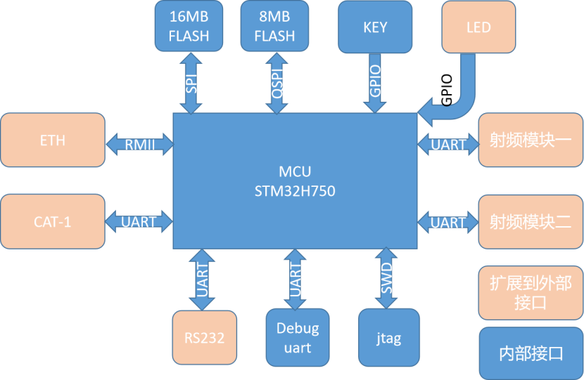
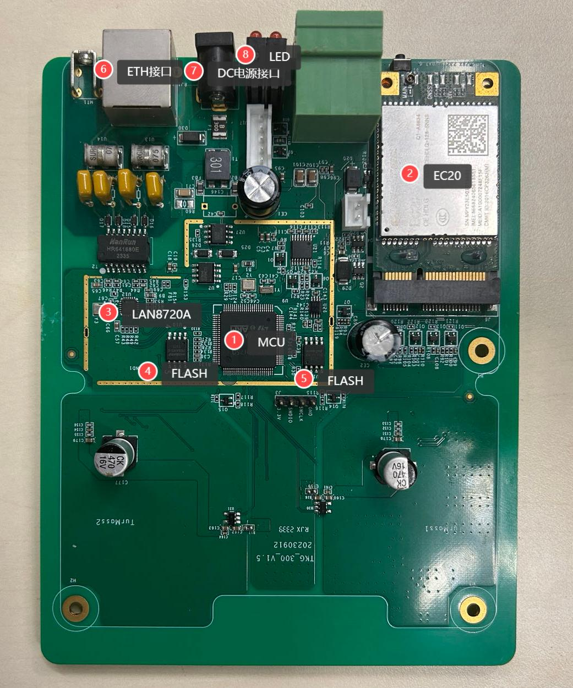
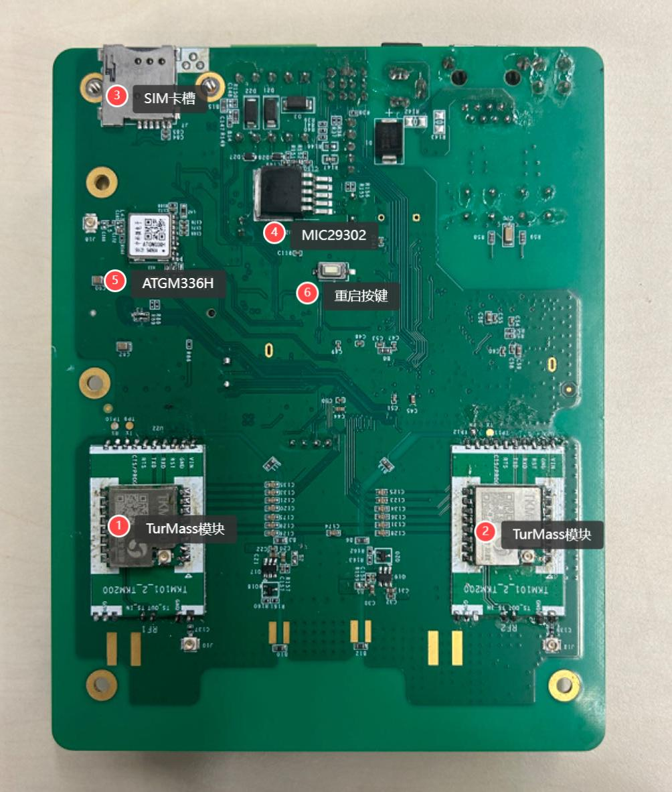

硬件说明
==========================

概述
++++++++++++++++++++++++++++++++++

| TKB-320 开发板是一款高性能、多功能的物联网网关开发平台，旨在加速物联网应用的原型设计与产品开发。采用高性能的 STM32H750VBT6 微控制器为核心，结合 cat1 模块与双 TurMasss 无线模组，为开发者提供了强大的数据处理能力以及完善的无线连接解决方案。

| 关键特性：

1. **高性能主控单元** ：搭建意法半导体 STM32H750VBT6 微控制器，基于高效的 ARM Cortex-M7 内核，集成浮点单元（FPU），并配备有大容量 RAM，确保高速数据处理与复杂算法执行。板载SWD调试/烧录接口，支持JTAG调试协议，便于快速开发与程序调试。
2. **Cat 1蜂窝通信模块** ：集成 Cat 1(Category 1)蜂窝通信模块，提供低功耗、广覆盖的 4G/LTE 连接能力。
3. **双TurMass无线模组** ：配置两个 TurMass 无线模组，为设备间的短距离无线通讯提供了高度灵活性与扩展性。

规格参数
++++++++++++++++++++++++++++++++++

.. csv-table:: 开发板基本参数
    :header: "参数", "说明"
    :widths: 40 60

    "尺寸", "117.5mm x 149.5mm"
    "主控MCU", "STM32H750VBT6"
    "无线通道数量", "2"
    "供电方式", "标配 5V@3A 电源适配器"
    "主要接口", "   
                 - DC电源输入接口  \*1 
                 - RJ45 \*1
                 - 无线SMA接口 \*2
                 - CAT.1 SMA接口 \*1
                 - Type-C座
               "
    "数据传输","CAT.1 或 ETH"
    "工作温度","-40℃~85℃"
    "存储温度","-50℃~85℃"
    "工作湿度","10%~95% 无凝露"

.. csv-table:: 无线模块参数
    :header: "参数", "说明"
    :widths: 40 60

    "通信标准",	"TurMass\ :sup:`TM`\"
    "调制方式",	"DPFSK"
    "通信频点",	"470~510MHz"
    "通信速率",	"0.4kbps ~ 85.1kbps"
    "发射功率",	"＞20dBm"
    "典型接收灵敏度",	"-130dBm\@1.8kbps"

硬件框图
++++++++++++++++++++++++++++++++++

板载资源
++++++++++++++++++++++++++++++++++

- **顶层硬件**

.. csv-table:: 硬件资源说明
    :header: "标号", "名称", "说明"
    :widths: 15 40 60

    "1",    "主控MCU",          "采用STM32H750VBT6作为主控MCU。
                                    - 主频为 480MHz，RAM 1MB, FLASH 128KB
                                    - ARMv7-M 架构 32bit Cortex-M7 CPU，集成 FPU、MPU
                                    - L1缓存（16 KB的I-缓存 +16 KB的D-缓存）提高外部存储器的执行性能
                                    - 多达35个通信接口包括FD-CAN、USB 2.0高速/全速、以太网MAC
                                "
    "2",    "EC20 模块",        "EC20 是一款 Cat1 模块，支持 LTE 双模无线上网，可以提供移动环境下高速数据接入服务。"
    "3",	"LAN8720A",	        "以太网芯片。
                                    - 高性能的 10/100M 以太网传输模块
                                    - 支持 RMII 接口以减少引脚数
                                    - 支持全双工和半双工模式
                                    - 支持自协商模式
                                    - 支持 MAC 接口
                                "
    "4",    "FLASH",	        "型号为 W25Q64JV。外扩的 SPI FLASH 芯片，容量为 64Mbit，也就是 8M 字节，可用于执行程序。"
    "5",    "FLASH",	        "型号为 W25Q128JV。外扩的 SPI FLASH 芯片，容量为 128Mbit，也就是 16M 字节，可用于存储用户数据、升级固件。"
    "6",    "ETH接口",	        "以太网接口。"
    "7",    "DC座",	            "电源插座，DC5V\@3A。"
    "8",    "LED",	            "6 个 LED 灯。"

- **底层硬件**

.. csv-table:: 硬件资源说明
    :header: "标号", "名称", "说明"
    :widths: 15 40 60

    "1、2",	"TurMass 无线模块", "无线模组，用于和终端进行无线数据交互。采用 TurMass 通信标准，频点470MHz~510MHz。"
    "3",    "SIM 卡槽",         "仅支持 nano SIM 卡。"
    "4",    "MIC29302",	        "电源芯片。"
    "5",	"ATGM336H",	        "GPS 模块。"
    "6",	"重启按键",	        "重启网关。"
