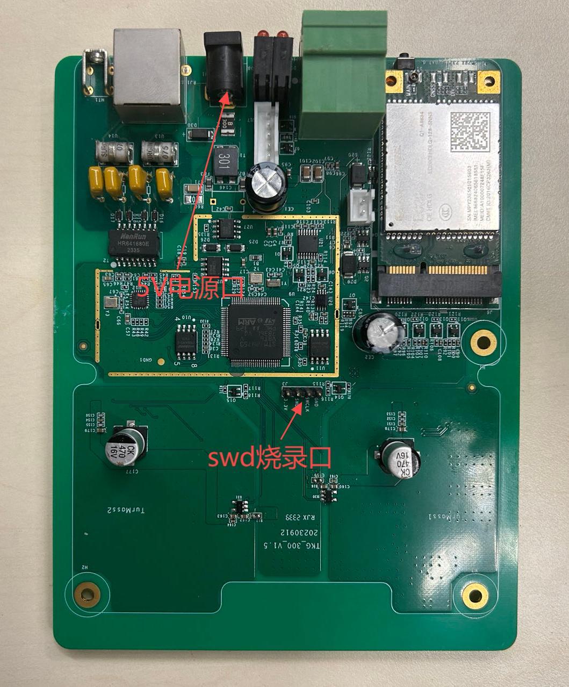
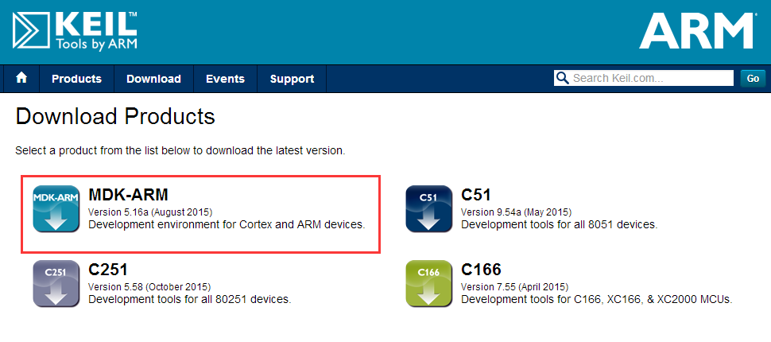
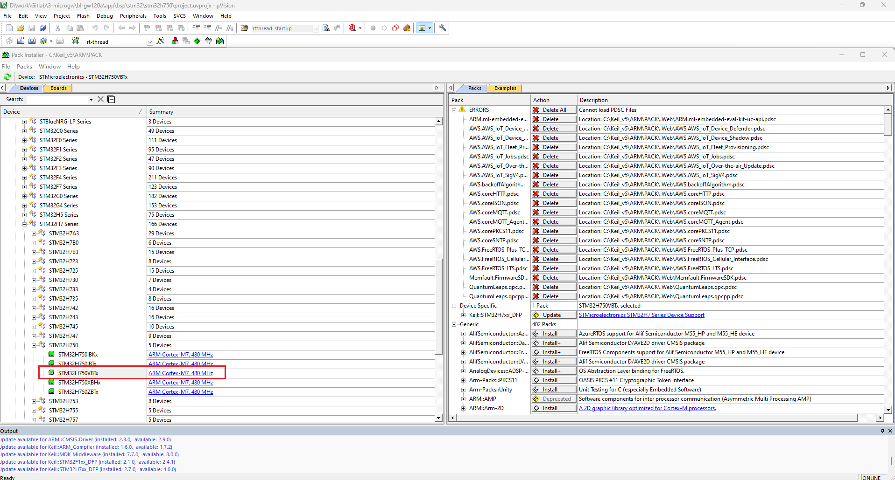
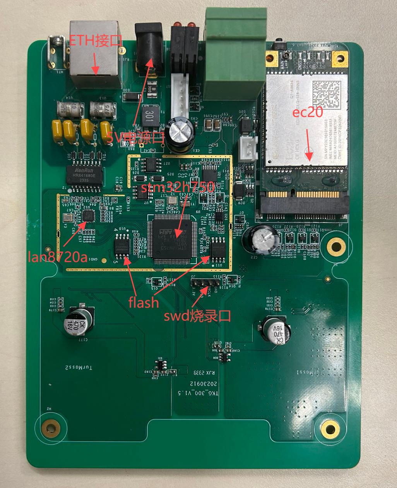
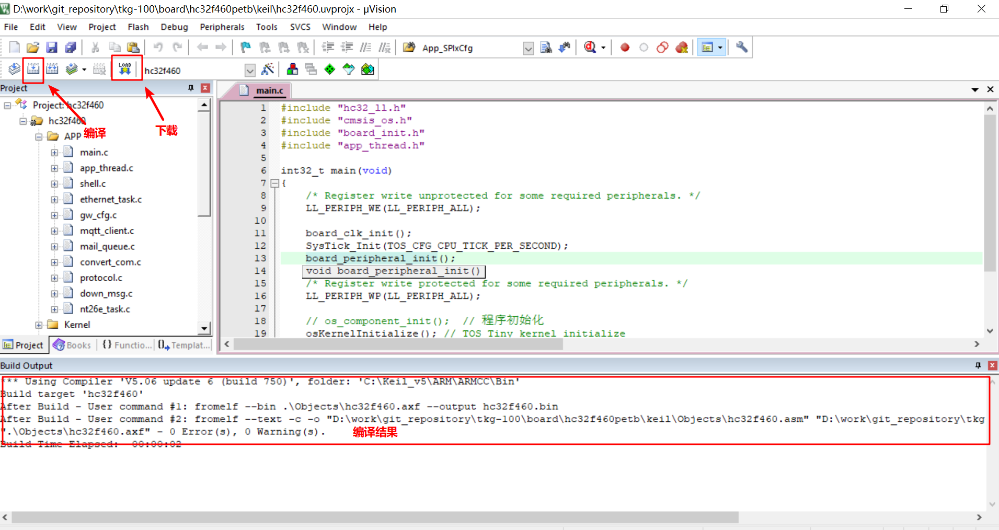

快速上手
=========

本章节介绍 `TKB-320` 网关开发板和 `TKB-320 SDK` 的基本情况。使开发者熟悉 `TKB-320 SDK` 的目录结构，并且可以将 SDK 提供的示例程序运行起来。

网关开发环境搭建
*****************

`TKB-320` 网关开发板是基于 `STM32H750VBT6` 控制器为主控的开发板。该开发板具有丰富的板载资源，可以充分发挥 `TurMass` 无线高并发功能。

开发板外观及资源如下图：

该开发板常用资源如下： 

- MCU：STM32H750VBT6，主频480MHz，128KB FLASH， 1MB RAM
- 外部FLASH：W25Q64（QSPI，64Mbit）
- 外部FLASH：W25Q128（SPI3，128Mbit）
- TurMass无线模块，（UART1，UART2）
- CAT1模块（UART4、USB）
- TTL调试串口（UART5）
- LAN8720A

软件编译环境搭建
*****************

- **获取 KEIL5 安装包**

通过搜索 ``KEIL5 下载`` 可找到下载文件，或者到 KEIL 官网下载：https://www.keil.com/download/product/。建议使用最新或者靠近版本都可以。

- **安装 KEIL5**

请参考《 KEIL5软件安装步骤_ 》，自行安装。

.. _KEIL5软件安装步骤: https://blog.csdn.net/wwwqqq2014/article/details/115412594

- **安装 STM32H7 芯片包**

下载 STM32H7芯片包_ 。把下载好的包双击安装即可，安装路径选择跟KEIL5一样的安装路径，安装成功后，在 KEIL5 的 Pack Installer 中就可以看到我们安装的包。

.. _STM32H7芯片包: https://www.keil.arm.com/packs/stm32h7xx_dfp-keil/versions/

- **安装 JLink**

使用我们提供的 JLink安装包_ 或者到 官网_ 下载。请参考《 J-Link驱动安装_ 》，自行安装。

.. _JLink安装包: http://download.taolink-tech.com:11280/alpha/download/TKB-200%E7%8E%AF%E5%A2%83%E6%90%AD%E5%BB%BA%E8%BD%AF%E4%BB%B6%E5%AE%89%E8%A3%85%E5%8C%85.zip

.. _官网: https://www.segger.com/downloads/jlink/JLink_Windows_beta.exe

.. _J-Link驱动安装: https://blog.csdn.net/qq_41990294/article/details/123821868

SDK 说明
*****************

SDK目录结构：

.. csv-table:: 
    :header: "名称", "说明"
    :widths: 40 60

    "bsp", "应用示例和芯片驱动"
    "components", "组件代码"
    "include", "RT-Thread内核头文件"
    "libcpu", "芯片架构适配"
    "src", "RT-Thread内核源码"

编译与下载
*****************

.. warning:: 输入电源DC5V。

- **运行示例工程**

进入 ``\bsp\stm32\stm32h750`` 文件夹中，双击 ``project.uvprojx`` 文件，打开 MDK5 工程，执行编译。编译完成后，点击下载按钮将固件下载至开发板，观察程序运行状况。

下载完成后，程序自动运行，观察串口打印情况：

.. code-block:: 

    \ | /
    - RT -     Thread Operating System
    / | \     4.0.3 build Sep  4 2024
    2006 - 2021 Copyright by rt-thread team
    lwIP-2.0.2 initialized!
    [3] I/SFUD: Find a Winbond flash chip. Size is 16777216 bytes.
    [4] I/SFUD: norflash0 flash device is initialize success.
    [5] I/SFUD: Probe SPI flash norflash0 by SPI device spi30 success.
    [D/FAL] (fal_flash_init:61) Flash device |                norflash0 | addr: 0x00000000 | len: 0x01000000 | blk_size: 0x00001000 |initialized finish.
    [I/FAL] ==================== FAL partition table ====================
    [I/FAL] | name       | flash_dev |   offset   |    length  |
    [I/FAL] -------------------------------------------------------------
    [I/FAL] | msu_image  | norflash0 | 0x00000000 | 0x00080000 |
    [I/FAL] | reserve    | norflash0 | 0x00080000 | 0x00080000 |
    [I/FAL] | download   | norflash0 | 0x00100000 | 0x00200000 |
    [I/FAL] | factory    | norflash0 | 0x00300000 | 0x00200000 |
    [I/FAL] | easyflash  | norflash0 | 0x00500000 | 0x00100000 |
    [I/FAL] | filesystem | norflash0 | 0x00800000 | 0x00800000 |
    [I/FAL] =============================================================
    [I/FAL] RT-Thread Flash Abstraction Layer (V0.5.0) initialize success.
    [Flash] (packages\EasyFlash\src\ef_env.c:1818) ENV start address is 0x00000000, size is 8192 bytes.
    [Flash] EasyFlash V4.1.0 is initialize success.
    [Flash] You can get the latest version on https://github.com/armink/EasyFlash .
    [40] I/at.svr: RT-Thread AT server (V1.3.1) initialize success.
    [42] I/sal.skt: Socket Abstraction Layer initialize success.
    [I/FAL] The FAL MTD NOR device (filesystem) created successfully
    [50] I/app.filesystem: mount to '/' success!
    EasyLogger V2.2.99 is initialize success.
    [68] D/gw.cfg: MAC: 8C:1F:64:C8:1C:60
    [75] D/gw.cfg: client id: 00390038-3430510C-33363230
    [76] D/gw.cfg: sub topic: 00390038-3430510C-33363230/msg/down
    [77] D/gw.cfg: pub topic: 00390038-3430510C-33363230/msg/up
    [78] I/at.clnt: AT client(V1.3.1) on device uart4 initialize success.
    [290] I/slip.clnt: SLIP client on device uart2 initialize success.
    [291] I/slip.clnt: SLIP client on device uart1 initialize success.
    [392] D/lan.module: Tk86xxGwSetSlotMaster:
    [471] D/lan.module: Tk86xxGwSetSlotSlave:

固件升级
*****************

网关升级包括 **STM32H750固件升级** 和 **TurMass无线模块升级**。可以参考 :ref:`gw320_upgrade-label` 。
