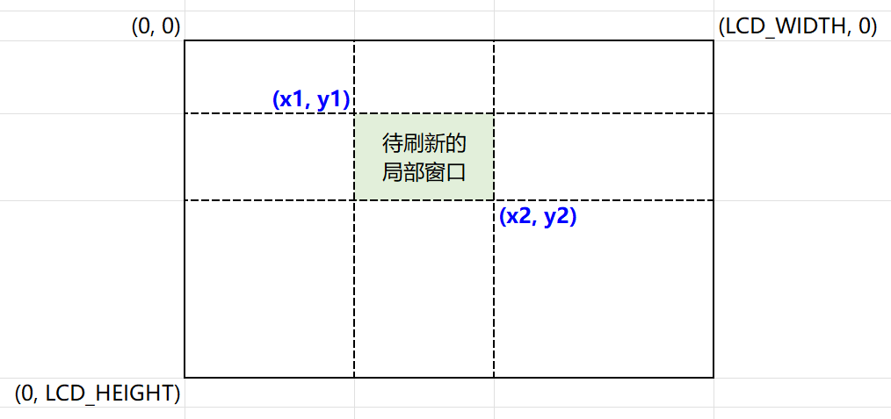

LVGL - 部分 QSPI 屏要求刷新窗口 2bytes 对齐问题
====================================================

QSPI 屏刷新局部窗口
--------------------------------------------------------

一般使用了 LVGL 后，QSPI 屏刷新的时候会仅刷新像素需要变化的局部窗口，画面有多处变化时会分为多个局部窗口来刷新，这种刷新通常需要 MCU 将需要刷新的局部窗口左上角和右下角坐标发给 QSPI LCD 的 Driver IC，接着再把这个局部窗口内的新像素数据发给 Driver IC。

问题描述
--------------------------------------------------------

刷新局部窗口的范围坐标是通过 LVGL 底层计算得到的，理论上是在屏的任意区域，即坐标可能是任意值。但有些 QSPI OLED 屏的 Driver IC(如：CO5300)要求局部窗口的坐标必须满足：

1. x1 为 2 的整数倍
2. (x2 + 1) 为 2 的整数倍
3. y1 为 2 的整数倍
4. (y2 + 1) 为 2 的整数倍

若不满足上述要求，则刷新的局部窗口会出现行偏移的错位现象，如下图所示。

针对该问题，屏厂的建议是通过刷整屏来解决。整屏刷新不仅只是改变局部窗口的坐标，还需要填充相应的像素数据，消耗更多的RAM空间，对资源受限的 MCU 不适合。不如按照上面四个要求来修改，也不用增大很多刷新数据量。

解决方法
--------------------------------------------------------

按照上述思路，我们来试着更改 LVGL 底层刷新部分，使每次刷新的局部窗口坐标满足 Driver IC 的要求。（使用的是 LVGL V8.3.11 版本）。

在 lvgl 文件夹下 ``src/core/lv_refr.c`` 中可以看到 LVGL 刷新相关的函数，局部窗口刷新是在函数 ``refr_area()`` 中，我们在该函数中做如下修改，主要目的是把局部窗口向上下左右扩展大一点，使 x1 为 2 的倍数，(x2 + 1) 为 2 的倍数，y1 为 2 的倍数，(y2 + 1) 为 2 的倍数。

1. 在 ``refr_invalid_areas`` 和 ``refr_area`` 函数之间，添加 ``refresh_area_align`` 函数。

.. code-block:: c
   :caption: refresh_area_align
   :linenos:

    #define LV_REQUIRE_REFRESH_ALIGN (1)
    #if LV_REQUIRE_REFRESH_ALIGN
    static void refresh_area_align(lv_area_t * area_p)
    {
        if (area_p->x1 % 2) {
            area_p->x1 = (area_p->x1 / 2) * 2;
            if (area_p->x1 <= 0) {
                area_p->x1 = 0;
            }
        }

        if ((area_p->x2 + 1) % 2) {
            area_p->x2 = (area_p->x2 / 2 + 1) * 2 - 1;
            if (area_p->x2 >= lv_disp_get_hor_res(disp_refr)) {
                area_p->x2 = lv_disp_get_hor_res(disp_refr) - 1;
            }
        }

        if (area_p->y1 % 2) {
            area_p->y1 = (area_p->y1 / 2) * 2;
            if (area_p->y1 <= 0) {
                area_p->y1 = 0;
            }
        }

        if ((area_p->y2 + 1) % 2) {
            area_p->y2 = (area_p->y2 / 2 + 1) * 2 - 1;
            if (area_p->y2 >= lv_disp_get_ver_res(disp_refr)) {
                area_p->y2 = lv_disp_get_ver_res(disp_refr) - 1;
            }
        }
    }
    #endif

2. 在 ``refr_area`` 函数中调用添加的 ``refresh_area_align`` 函数。

.. code-block:: c
   :caption: refresh_area_align
   :emphasize-lines: 26-29
   :linenos:

    static void refr_area(const lv_area_t * area_p)
    {
        lv_draw_ctx_t * draw_ctx = disp_refr->driver->draw_ctx;
        draw_ctx->buf = disp_refr->driver->draw_buf->buf_act;

        /*With full refresh just redraw directly into the buffer*/
        /*In direct mode draw directly on the absolute coordinates of the buffer*/
        if(disp_refr->driver->full_refresh || disp_refr->driver->direct_mode) {
            lv_area_t disp_area;
            lv_area_set(&disp_area, 0, 0, lv_disp_get_hor_res(disp_refr) - 1, lv_disp_get_ver_res(disp_refr) - 1);
            draw_ctx->buf_area = &disp_area;

            if(disp_refr->driver->full_refresh) {
                disp_refr->driver->draw_buf->last_part = 1;
                draw_ctx->clip_area = &disp_area;
                refr_area_part(draw_ctx);
            }
            else {
                disp_refr->driver->draw_buf->last_part = disp_refr->driver->draw_buf->last_area;
                draw_ctx->clip_area = area_p;
                refr_area_part(draw_ctx);
            }
            return;
        }

    #if LV_REQUIRE_REFRESH_ALIGN
        /*Align the refresh area to the screen boundary*/
        refresh_area_align((lv_area_t *)area_p);
    #endif

        /*Normal refresh: draw the area in parts*/
        /*Calculate the max row num*/
        lv_coord_t w = lv_area_get_width(area_p);
        lv_coord_t h = lv_area_get_height(area_p);
        lv_coord_t y2 = area_p->y2 >= lv_disp_get_ver_res(disp_refr) ?
                        lv_disp_get_ver_res(disp_refr) - 1 : area_p->y2;

        int32_t max_row = get_max_row(disp_refr, w, h);

        lv_coord_t row;
        lv_coord_t row_last = 0;
        lv_area_t sub_area;
        for(row = area_p->y1; row + max_row - 1 <= y2; row += max_row) {
            /*Calc. the next y coordinates of draw_buf*/
            sub_area.x1 = area_p->x1;
            sub_area.x2 = area_p->x2;
            sub_area.y1 = row;
            sub_area.y2 = row + max_row - 1;
            draw_ctx->buf_area = &sub_area;
            draw_ctx->clip_area = &sub_area;
            draw_ctx->buf = disp_refr->driver->draw_buf->buf_act;
            if(sub_area.y2 > y2) sub_area.y2 = y2;
            row_last = sub_area.y2;
            if(y2 == row_last) disp_refr->driver->draw_buf->last_part = 1;
            refr_area_part(draw_ctx);
        }

        /*If the last y coordinates are not handled yet ...*/
        if(y2 != row_last) {
            /*Calc. the next y coordinates of draw_buf*/
            sub_area.x1 = area_p->x1;
            sub_area.x2 = area_p->x2;
            sub_area.y1 = row;
            sub_area.y2 = y2;
            draw_ctx->buf_area = &sub_area;
            draw_ctx->clip_area = &sub_area;
            draw_ctx->buf = disp_refr->driver->draw_buf->buf_act;
            disp_refr->driver->draw_buf->last_part = 1;
            refr_area_part(draw_ctx);
        }
    }

3. 在 ``draw_buf_rotate`` 函数中添加 ``height`` 相关修改，本示例中液晶旋转 90 度。

.. code-block:: c
   :caption: refresh_area_align
   :emphasize-lines: 35-37
   :linenos:

    static void draw_buf_rotate(lv_area_t * area, lv_color_t * color_p)
    {
        lv_disp_drv_t * drv = disp_refr->driver;
        if(disp_refr->driver->full_refresh && drv->sw_rotate) {
            LV_LOG_ERROR("cannot rotate a full refreshed display!");
            return;
        }
        if(drv->rotated == LV_DISP_ROT_180) {
            draw_buf_rotate_180(drv, area, color_p);
            call_flush_cb(drv, area, color_p);
        }
        else if(drv->rotated == LV_DISP_ROT_90 || drv->rotated == LV_DISP_ROT_270) {
            /*Allocate a temporary buffer to store rotated image*/
            lv_color_t * rot_buf = NULL;
            lv_disp_draw_buf_t * draw_buf = lv_disp_get_draw_buf(disp_refr);
            lv_coord_t area_w = lv_area_get_width(area);
            lv_coord_t area_h = lv_area_get_height(area);
            /*Determine the maximum number of rows that can be rotated at a time*/
            lv_coord_t max_row = LV_MIN((lv_coord_t)((LV_DISP_ROT_MAX_BUF / sizeof(lv_color_t)) / area_w), area_h);
            lv_coord_t init_y_off;
            init_y_off = area->y1;
            if(drv->rotated == LV_DISP_ROT_90) {
                area->y2 = drv->ver_res - area->x1 - 1;
                area->y1 = area->y2 - area_w + 1;
            }
            else {
                area->y1 = area->x1;
                area->y2 = area->y1 + area_w - 1;
            }

            /*Rotate the screen in chunks, flushing after each one*/
            lv_coord_t row = 0;
            while(row < area_h) {
                lv_coord_t height = LV_MIN(max_row, area_h - row);
    #if LV_REQUIRE_REFRESH_ALIGN
                if (height % 2 == 1) height++;
    #endif
                draw_buf->flushing = 1;
                if((row == 0) && (area_h >= area_w)) {
                    /*Rotate the initial area as a square*/
                    height = area_w;
                    draw_buf_rotate_90_sqr(drv->rotated == LV_DISP_ROT_270, area_w, color_p);
                    if(drv->rotated == LV_DISP_ROT_90) {
                        area->x1 = init_y_off;
                        area->x2 = init_y_off + area_w - 1;
                    }
                    else {
                        area->x2 = drv->hor_res - 1 - init_y_off;
                        area->x1 = area->x2 - area_w + 1;
                    }
                }
                else {
                    /*Rotate other areas using a maximum buffer size*/
                    if(rot_buf == NULL) rot_buf = lv_mem_buf_get(LV_DISP_ROT_MAX_BUF);
                    draw_buf_rotate_90(drv->rotated == LV_DISP_ROT_270, area_w, height, color_p, rot_buf);

                    if(drv->rotated == LV_DISP_ROT_90) {
                        area->x1 = init_y_off + row;
                        area->x2 = init_y_off + row + height - 1;
                    }
                    else {
                        area->x2 = drv->hor_res - 1 - init_y_off - row;
                        area->x1 = area->x2 - height + 1;
                    }
                }

                /* The original part (chunk of the current area) were split into more parts here.
                * Set the original last_part flag on the last part of rotation. */
                if(row + height >= area_h && draw_buf->last_area && draw_buf->last_part) {
                    draw_buf->flushing_last = 1;
                }
                else {
                    draw_buf->flushing_last = 0;
                }

                /*Flush the completed area to the display*/
                call_flush_cb(drv, area, rot_buf == NULL ? color_p : rot_buf);
                /*FIXME: Rotation forces legacy behavior where rendering and flushing are done serially*/
                while(draw_buf->flushing) {
                    if(drv->wait_cb) drv->wait_cb(drv);
                }
                color_p += area_w * height;
                row += height;
            }
            /*Free the allocated buffer at the end if necessary*/
            if(rot_buf != NULL) lv_mem_buf_release(rot_buf);
        }
    }

修改后现象如下。有些屏可能要求的不是 2 的整数倍，而是必须为 4 的整数倍，也可用类似的方式修改。
