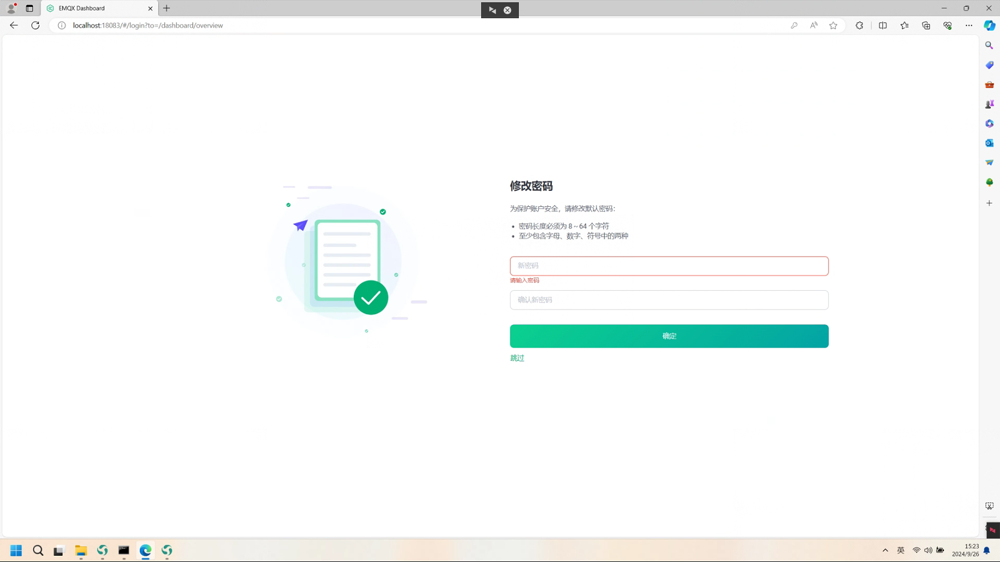

Windows 本地搭建 MQTT 服务器
==============================================

下载安装包
-------------------------------------------------------

1. 下载链接：emqx官网_ 下载。

2. 选择合适的版本下载：选择 windows 系统版本的安装包，我们选择 5.3.2_ 版本安装包。

.. _emqx官网: https://www.emqx.com/zh/downloads/broker

.. _5.3.2: https://www.emqx.com/zh/downloads/broker/v5.3.2/emqx-5.3.2-windows-amd64.zip

安装软件
-------------------------------------------------------

1. 解压安装包。解压目录不能存在中文、空格、特殊字符。

2. 打开其中 bin 文件夹，在地址栏复制地址。

3. 单击开始菜单，输入命令：``cmd``，选择以管理员身份运行。

4. 在命令行内切换到EMQX bin文件目录。

.. note:: 可以通过 ``cd`` 命令切换。若盘符不同，请先切换盘符。

5. 安装 MQTT 服务器，输入命令：``.\emqx.cmd install``。此命令只执行一次，以后开机不用执行了。

.. note:: 卸载 EMQX 服务，执行命令：``.\emqx.cmd uninstall``。

提示 *ChangeServiceConfig* 成功，则说明服务安装成功。

6. 启动 EMQX 服务，输入命令：``.\emqx.cmd console``。

提示 *EMQX 5.3.2 is running now!* 说明服务启动成功。

7. 浏览器输入地址：``http://localhost:18083``。访问 MQTT 服务器的网页。在登录页面输入初始化账号和密码即可登录。

.. note:: MQTT 服务器默认账号为 **admin**，密码为 **public** 。

8. 输入初始密码后，会跳转到修改密码页面。修改密码后再次登录即可。

